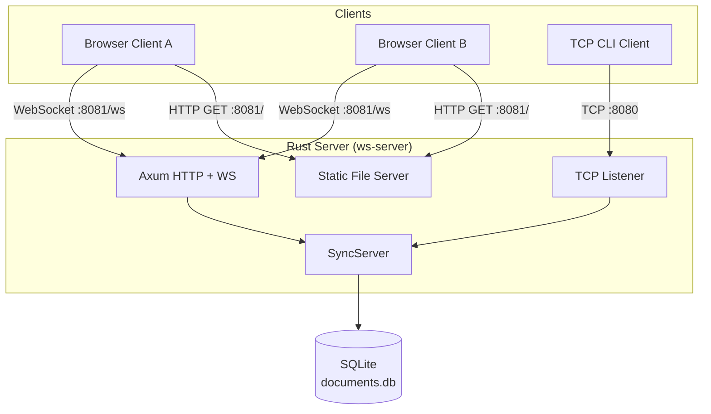
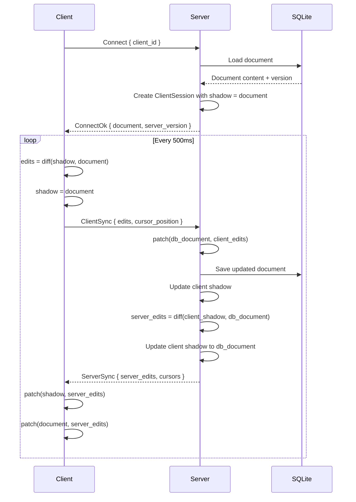
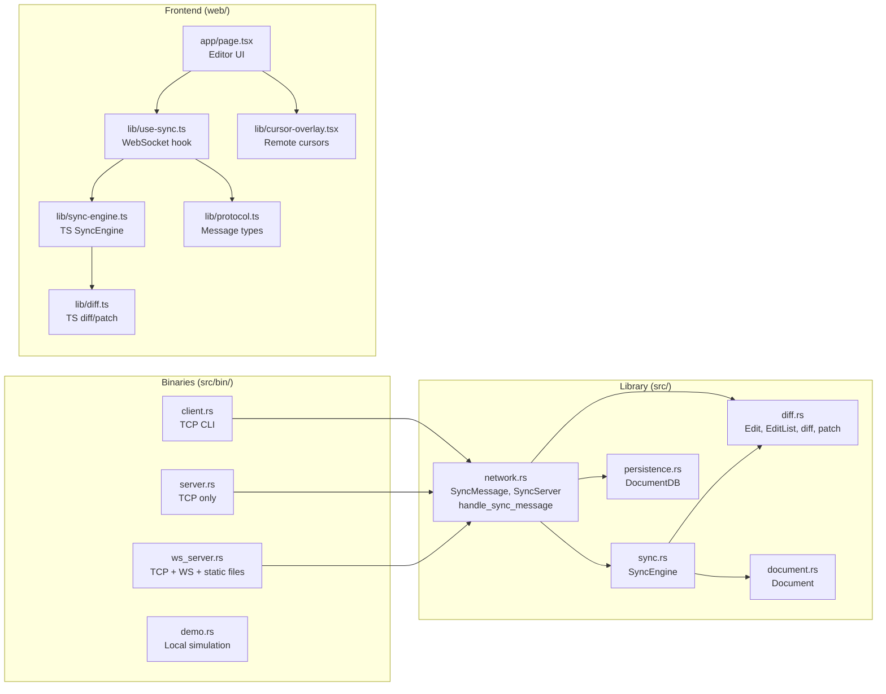
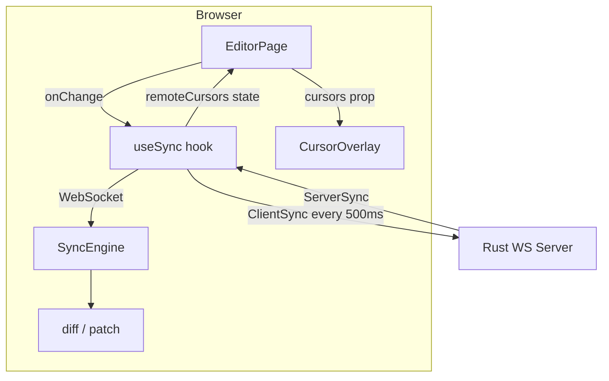

# System Architecture

## Overview

A real-time collaborative editor built on Neil Fraser's [Differential Synchronization](https://neil.fraser.name/writing/sync/) algorithm. A Rust server handles document persistence and multi-client synchronization over both TCP and WebSocket, while a Next.js frontend provides the browser-based editing interface.

## System Topology



The `ws-server` binary runs two listeners on separate ports. Axum serves both the Next.js static export and WebSocket upgrades on `:8081`. A plain TCP listener on `:8080` supports the CLI client. Both transports share a single `SyncServer` instance behind `Arc<Mutex<_>>`.

## Core Algorithm: Dual-Shadow Sync

Each client maintains a **document** (working copy) and a **shadow** (last agreed state with the server). The server maintains a per-client shadow to track what each client has seen.



The key insight: the server diffs each client's shadow against the current DB document. This produces edits containing only changes from *other* clients, since the requesting client's own edits have already been applied.

## Module Structure



## Wire Protocol

Messages are serialized as externally-tagged JSON (serde default). TCP uses newline-delimited JSON; WebSocket uses one message per frame.

| Message | Direction | Purpose |
|---------|-----------|---------|
| `Connect` | Client → Server | Join session with a `client_id` |
| `ConnectOk` | Server → Client | Confirm connection, send current document |
| `ClientSync` | Client → Server | Send local edits + cursor position |
| `ServerSync` | Server → Client | Return other clients' edits + all remote cursors |
| `Ping` / `Pong` | Both | Keepalive (30s interval on TCP) |
| `Disconnect` | Client → Server | Leave session |
| `Error` | Server → Client | Error response |

### Cursor Tracking

Cursor positions piggyback on the existing sync cycle — no separate message type or broadcast channel required. Each `ClientSync` includes an optional `cursor_position`. The server stores it per session and returns all other clients' cursors (with assigned colors) in every `ServerSync` response. This gives ~500ms cursor update latency.

## Diff/Patch Engine

Both Rust (`src/diff.rs`) and TypeScript (`web/lib/diff.ts`) implement the same algorithm:

1. **diff(from, to)**: Strip common prefix and suffix, emit a single `Insert`, `Delete`, or `Replace` for the differing middle
2. **patch(text, edits)**: Apply edits in reverse order to avoid position shifts; clamp positions to bounds for fuzzy tolerance

All positions are **byte offsets** (Rust strings are UTF-8 byte arrays). The TypeScript side uses `TextEncoder`/`TextDecoder` to produce compatible offsets. Each `EditList` carries a checksum of the source text for validation.

## Persistence

SQLite stores documents with content, version number, and timestamps. The server reads the document on each sync cycle and writes back after applying client edits. The `DocumentDB` initializes with a default document on first run.

## Frontend Architecture

The Next.js app is built as a static export (`output: "export"`) and served directly by the Rust server — no separate Node.js process in production.



The `useSync` hook manages the full lifecycle: WebSocket connection, reconnection with exponential backoff, 500ms sync interval, and cursor position tracking. The `CursorOverlay` renders remote user name tags at cursor positions using a transparent overlay div mirroring the textarea's font and layout.

## Deployment

For local development:
```
cargo run --bin ws-server    # serves everything on :8081
```

For remote access (e.g., mobile via ngrok):
```
ngrok http 8081              # single tunnel covers both static files and WebSocket
```

The frontend derives the WebSocket URL from `window.location`, so it works transparently behind reverse proxies and HTTPS tunnels.
